# Starbucks Capstone Challenge
### Udacity Data Science Nanodegree


## Introduction

This project is the final assignment for the Udacity Data Science Nanodegree program. The goal of the project is to analyze simulated data from the Starbucks mobile app to find out what demographics of users respond to certain promotions in order to optimize offerings.

The following information was provided as part of the project:

> **Introduction**
>
> This data set contains simulated data that mimics customer behavior on the Starbucks rewards mobile app. Once every few days, Starbucks sends out an offer to users of the mobile app. An offer can be merely an advertisement for a drink or an actual offer such as a discount or BOGO (buy one get one free). Some users might not receive any offer during certain weeks. 
> Not all users receive the same offer, and that is the challenge to solve with this data set.
> Your task is to combine transaction, demographic and offer data to determine which demographic groups respond best to which offer type. This data set is a simplified version of the real Starbucks app because the underlying simulator only has one product whereas Starbucks actually sells dozens of products.
> Every offer has a validity period before the offer expires. As an example, a BOGO offer might be valid for only 5 days. You'll see in the data set that informational offers have a validity period even though these ads are merely providing information about a product; for example, if an informational offer has 7 days of validity, you can assume the customer is feeling the influence of the offer for 7 days after receiving the advertisement.
> You'll be given transactional data showing user purchases made on the app including the timestamp of purchase and the amount of money spent on a purchase. This transactional data also has a record for each offer that a user receives as well as a record for when a user actually views the offer. There are also records for when a user completes an offer. 
> Keep in mind as well that someone using the app might make a purchase through the app without having received an offer or seen an offer.
>
> **Example**
>
> To give an example, a user could receive a discount offer buy 10 dollars get 2 off on Monday. The offer is valid for 10 days from receipt. If the customer accumulates at least 10 dollars in purchases during the validity period, the customer completes the offer.
> However, there are a few things to watch out for in this data set. Customers do not opt into the offers that they receive; in other words, a user can receive an offer, never actually view the offer, and still complete the offer. For example, a user might receive the "buy 10 dollars get 2 dollars off offer", but the user never opens the offer during the 10 day validity period. The customer spends 15 dollars during those ten days. There will be an offer completion record in the data set; however, the customer was not influenced by the offer because the customer never viewed the offer.
>
> **Cleaning**
>
> This makes data cleaning especially important and tricky.
> You'll also want to take into account that some demographic groups will make purchases even if they don't receive an offer. From a business perspective, if a customer is going to make a 10 dollar purchase without an offer anyway, you wouldn't want to send a buy 10 dollars get 2 dollars off offer. You'll want to try to assess what a certain demographic group will buy when not receiving any offers.
>
> **Final Advice**
>
> Because this is a capstone project, you are free to analyze the data any way you see fit. For example, you could build a machine learning model that predicts how much someone will spend based on demographics and offer type. Or you could build a model that predicts whether or not someone will respond to an offer. Or, you don't need to build a machine learning model at all. You could develop a set of heuristics that determine what offer you should send to each customer (i.e., 75 percent of women customers who were 35 years old responded to offer A vs 40 percent from the same demographic to offer B, so send offer A).

## Installation

This project uses [jupyter](https://jupyter.org/) notebooks. The **requirements.txt** file contains information about required packages. Create a [conda](https://anaconda.org/) environment with all required packages:

`conda create --name <env> --file requirements.txt`

All the code for the project is in the **Starbucks_Capstone_notebook.ipynb** notebook.

## CRISP-DM process

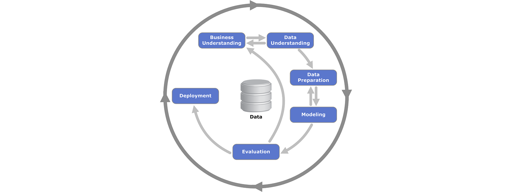

This project uses the [cross-industry standard for data mining](https://en.wikipedia.org/wiki/Cross-industry_standard_process_for_data_mining) (CRISP-DM) process model. An overview of how this project breaks down to the six phases of the model:

1. **Business Understanding** - Startbucks sends promotions to user through multiple channels (web, email etc..). Customers may use these promotions to find out about new products, or get discounts on purchases.
2. **Data Understanding** - We look at the data to find out what columns we have, what values the columns contain and to gain some understanding of the promotions, customer profiles and customer actions.
3. **Data Preparation** - We'll make sure that the data is ready for modeling for example check to see if there are missing values and create columns for categorical values.
4. **Modeling** - We'll process the transcript records and create a data set that is focused on each offer. We'll analyze the new data set to find out which offer works best for which demographics, and we'll also use a linear regression model to analyze which promotion delivery channel is the most successful.
5. **Evaluation** - We'll split the data into training and testing sets so we can evaluate the model's efficiency.
6. **Deployment** - Deployment is not in the scope of this project.

## Data Understanding

### Data Sets

The data is contained in three files:

* portfolio.json - containing offer ids and meta data about each offer (duration, type, etc.)
* profile.json - demographic data for each customer
* transcript.json - records for transactions, offers received, offers viewed, and offers completed

Here is the schema and explanation of each variable in the files:

**data/portfolio.json**
* id (string) - offer id
* offer_type (string) - type of offer ie BOGO, discount, informational
* difficulty (int) - minimum required spend to complete an offer
* reward (int) - reward given for completing an offer
* duration (int) - time for offer to be open, in days
* channels (list of strings)

**data/profile.json**
* age (int) - age of the customer 
* became_member_on (int) - date when customer created an app account
* gender (str) - gender of the customer (note some entries contain 'O' for other rather than M or F)
* id (str) - customer id
* income (float) - customer's income

**data/transcript.json**
* event (str) - record description (ie transaction, offer received, offer viewed, etc.)
* person (str) - customer id
* time (int) - time in hours since start of test. The data begins at time t=0
* value - (dict of strings) - either an offer id or transaction amount depending on the record

### Reading the Data

The data is stored in [JSON](https://en.wikipedia.org/wiki/JSON) files. We can read them using the [pandas.read_json](https://pandas.pydata.org/docs/reference/api/pandas.read_json.html) function into [pandas.DataFrame](https://pandas.pydata.org/docs/reference/api/pandas.DataFrame.html)s.

```
portfolio = pd.read_json('data/portfolio.json', orient='records', lines=True)
profile = pd.read_json('data/profile.json', orient='records', lines=True)
transcript = pd.read_json('data/transcript.json', orient='records', lines=True)
```

### Exploring General Info about DataFrames

I wrote the `display_data_frame_info()` function to show generic information about DataFrames, such as their shape, names and types of columns, the output of pandas.describe etc..

```
def display_dataframe_info(df, df_name):
    """ Display information about a pandas.DataFrame, for example shape, names and types of columns etc.

    Inputs:
      df: the DataFrame
      df_name: the name of the DataFrame to be displayed
    """
    display(HTML('<hr>'))
    display(HTML(f'<h2 style="text-align: center;">{df_name} DataFrame info</h2>'))
    # print(f'---- {df_name} ----')
    print(f'number of rows: {df.shape[0]}')
    print(f'number of cols: {df.shape[1]}')

    display(df.head())

    print('columns:')
    for col in df.columns:
        data_type = df[col].dtype
        num_nan = df[col].isna().sum()
        if num_nan:
            print(f'  {col} ({data_type}, NaN:{num_nan})')
        else:
            print(f'  {col} ({data_type})')
        if data_type==object:
            # print list of values and number of occurance of each value for categorical columns
            try:  # some columns might have unhashable values, for example lists
                values = list(df.groupby(col).groups.keys())
                if len(values)>9:  # if there are too many unique values, skip
                    continue
                print(f'    values:{values}')
                for i,v in df.groupby(col).count().max(axis=1).iteritems():
                    print(f'      {i}: {v}')
            except:
                pass

    display(df.describe())
```

The **Starbucks_Capstone_notebook.ipynb** contains the output of the `display_data_frame_info()` function for the **portfolio**, **profile** and **transcript** data sets.

There are 17,000 records of customers in the **profile** data set. A few records from the data:

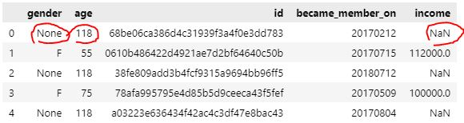

There are 2,175 record without demographic info: **gender** and **income** are **NaN**s, and age is set to 118. To make sure that the numeric 118 values won't affect calculations, we'll replace those with **NaN**s.

```
profile['age'] = profile['age'].replace(118, np.NaN)
```

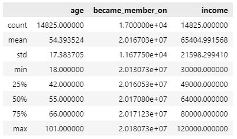

The minimum age of customers is 18, the maximum age is 101 with a mean of 54.39.

Income values are between 30,000 and 120,000 with a mean of 65,405.

There are 10 portfolio records describing promotional offers.

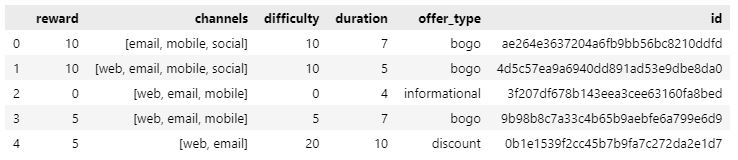

There are three types of offers: **bogo** (buy one get one free), **discount** and **informational**. Each offer has a duration. We are also provided with information about the channels (eg. email, mobile, social etc..) where the promotion is delivered.

There are 306,534 transcript records describing events around offers.

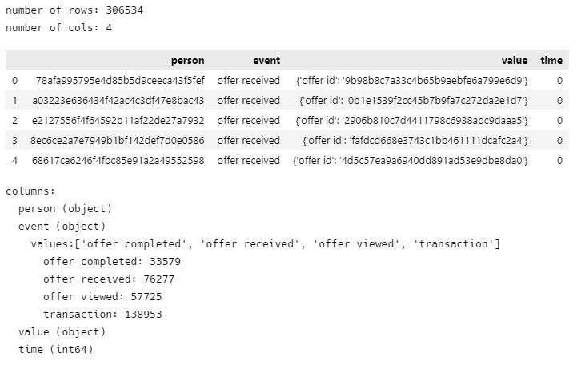

There are 4 event types:
- **offer received** - indicates that an offer was delivered to the customer
- **offer viewed** - the customer looked at the offer
- **transaction** - the customer made a purchase; unfortunately the purchase records are not tied to offers
- **offer completed** - when the customer completes the number of purchases to receive a reward from the promotion


### Data Cleanup and Preparation

The following steps were taken to clean up and prepare the data sets:
1. Made sure that either all demographic info (age, gender, income) is present or all demographic info is missing (NaN)
1. Converted the **time** column in the **transcript** data set to days to match the time units of **profile**
1. Converted the **became_member_on** integer dates (eg. 20170312) to days elapsed from the first record 
1. Created bins for age and income values, for example 10s, 20s, 30s, etc for **age** and 25k+, 50k+ etc for **income**
1. Made dummy columns for categorical values like **offer_type** and the binned columns

### Binned and Dummy Columns

The binned columns and dummy columns make it easy to plot information about the distribution of values. The following graphs show the distribution of **age**, **gender** and **income**: 

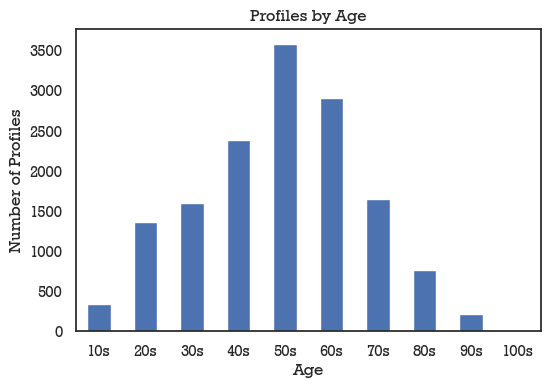

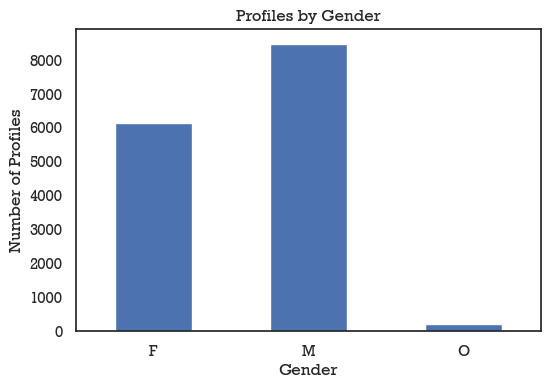

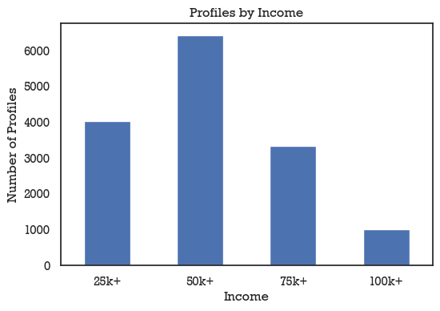

### Parsing Offer Records

Currently transactions, information about promotions and demographic info about customers are in separate tables.

We need to combine all these tables and find purchase transactions that were influenced by promotions.

Unfortunately transactions don't indicate whether purchases are tied to a specific promotion, so we'll have to assume that after a customer receives and views a promotion, the purchases belong to that offer until the offer completes or expires.

We'll create records for each offer with these fields:
- **person_id** - id of the person who received the offer
- **offer_id** - id of the offer matching the portfolio dataset
- **start_date** - date of offer received, in days after start of experiment
- **end_date** - date offer expires, in days after start of experiment
- **viewed** - whether the offer was viewed
- **completed** - wheteher the offer was completed
- **transaction_count** - number of sales tied to this offer
- **transaction_total** - purchase total

To parse records, we'll use a finite state machine. The possible states of an offer:
- **offer_received**: this is when the offer record is created; even though the customer received the offer, at this point the offer not used until the customer looks at the offer
- **offer_viewed**: in this state the offer is active; any purchase that the customer makes from this point on will be added to this offer, until:
  - the offer expires
  - the offer completes
  - a new offer is received
- **offer_completed**: at this point the offer is closed because the customer made enough purchases to earn the reward from the offer

The code for the class encapsulating the offer and the code that parse the transcript records using a finite state machine:

```
class OfferRecord:
    """This class is used to store information about an offer given to a customer."""
    def __init__(self, person_id, offer_id, date, duration):
        """Initializes an OfferRecord instance.
        Inputs: 
          person_id: id of customer
          offer_id: id of offer
          date: date offer is received (in days)
          duration: how long this offer is valid for (in days)
        """
        self.person_id = person_id
        self.offer_id = offer_id
        self.start_date = date
        self.end_date = self.start_date + duration
        self.viewed = 0
        self.completed = 0
        self.transaction_count = 0
        self.transaction_total = 0

    def as_dict(self):
        """Returns an OfferRecord as a python dict.
        Returns:
          dict: a python dictionary with the offer's properties
        """
        d = {}
        d['person_id'] = self.person_id
        d['offer_id'] = self.offer_id
        d['offer_viewed'] = self.viewed
        d['offer_completed'] = self.completed
        d['offer_start_date'] = self.start_date
        d['offer_end_date'] = self.end_date
        d['transaction_count'] = self.transaction_count
        d['transaction_total'] = self.transaction_total
        return(d)

    def __str__(self):
        """Returns a python string representation of the class, usually used to print the object."""
        return(f'{self.person_id} {self.offer_id} {self.start_date} {self.end_date} {self.viewed} {self.completed} {self.transaction_count} {self.transaction_total}')

def parse_offer_records(customer_transcript, portfolio):
    """
    Parses transcript records for offers a customer received and used.

    Inputs:
      customer_transcript: DataFrame containing all transcript records for a customer id, in chronological order
      portfolio: the portfolio DataFrame (used to get info about offers)

    Returns:
      offer_records: a list of offers records for the customer id
    """
    offer_record = None
    offer_records = []
    for i in range(len(customer_transcript)):
        r = customer_transcript.iloc[i]
        if r.event == 'offer received':
            if offer_record is not None:
                offer_records.append(offer_record)
            offer_id = r.value['offer id']
            offer_duration = portfolio.loc[portfolio.offer_id==offer_id].duration.item()
            offer_record = OfferRecord(r.person, offer_id, r.time, offer_duration)
        elif r.event == 'offer viewed':
            if r.value['offer id'] != offer_record.offer_id:
                print(f'offer id mismatch (viewed): person:{offer_record.person_id} {offer_record.offer_id} {r.value["offer id"]}')
            offer_record.viewed = 1
        elif r.event == 'offer completed':
            if offer_record.viewed and r.value['offer_id'] == offer_record.offer_id:
                offer_record.completed = 1
        elif r.event == 'transaction':
            if offer_record and offer_record.viewed and r.time<=offer_record.end_date:
                offer_record.transaction_count += 1
                offer_record.transaction_total += r.value['amount']
        
    if offer_record is not None:
        offer_records.append(offer_record)
            
    return offer_records
```

### Merging the Portfolio and Profile Information to the Offers

After parsing the transcripts, we have an offer centric data set. We can now use the **id** field to merge the corresponding additional info to each offer about customer (profiles data set) and promotions (portfoloi date set).

```
offers = pd.merge(offers, profile, on='person_id')
offers = pd.merge(offers, portfolio, on='offer_id')
```

## Evaluating Offer Performance for Demographics

We are trying to find out which offer works best for different demographics, so now we can remove profiles from the data set with **NaN** values because we proved earlier that profile records with **NaN**s are missing all demographics info.

The distribution of promotions sent to customers by age matches the distribution of customers by age, indicating that there was no bias towards specific age groups when the promotions were sent:

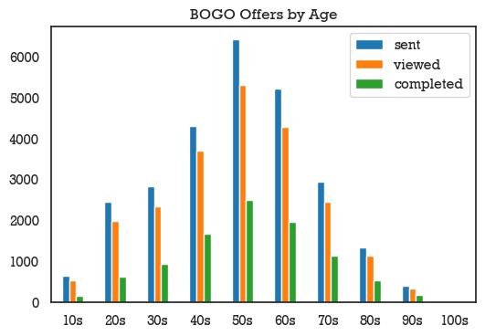

In order to find out which age group views and completes the offer at a higher rate, we normalize the values to 100% of promotions sent:

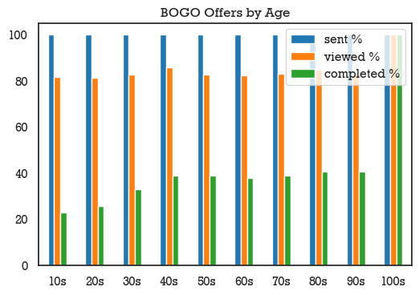

It looks like younger people are less likely to complete offers than people 40 years of age or higher. Based on the graph it looks like people in their 100s view and complete all offers, but this is an anomaly due to having only two offers sent to people in that age group:

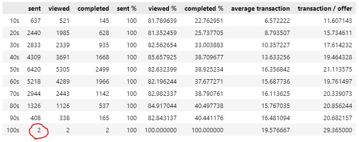

Another interesting way to look at the offers is the average purchases made after the offer was received:

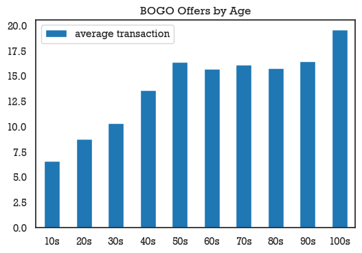

People in the younger age brackets spend less money on average. The maximum average amount is spent by people in their 50s. Again, we'll have to ignore the 100+ age bracket because of the low number of samples.

Yet another way to look at the performance of offers is to analyze the amount spent by the number of offers delivered. This would probably be more important with traditional delivery methods like mailing where there is a significant cost to delivering the offer to customers.

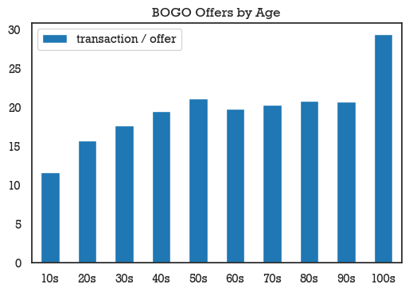

The jupyter notebook (**Starbucks_Capstone_notebook.ipynb**) contains plots for BOGO, discount and informational offer by all demographic categories (age, gender and income), so I will highlight only a few additional interesting graphs here.

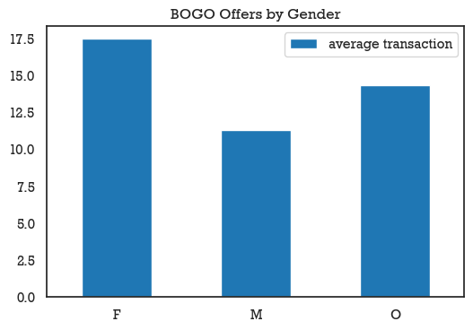

Females spend on average more per transactions after receiving a promotion.

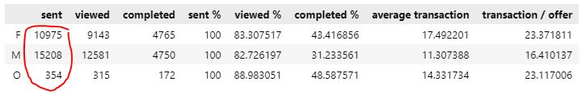

There are much fewer records of people identifying as "Other" gender, so the information about that demographic group is less accurate.

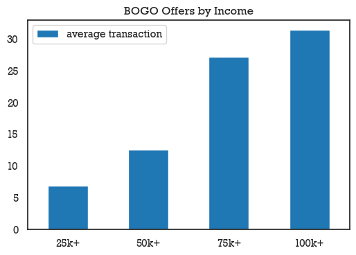

People in higher income brackets, probably not surprisingly, spend more per average transaction after receiving promotional offers.

### Offer Types by Demographics

Let's look at what type of offer work best different demographics. We'll use the transaction per offer measure to compare the performance of promotions.

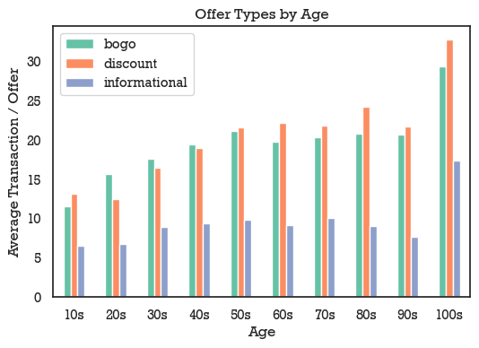

Informational offer in general are much less effective than BOGO and discount offer at all age groups.

For younger people in their 20s, 30s and 40s, the BOGO offers slightly outperform the discount offers, while for people in their 50s and above the discount offers turn into more sales. (Again, ignore the 100s data as there are very few samples to draw a conclusion there.)

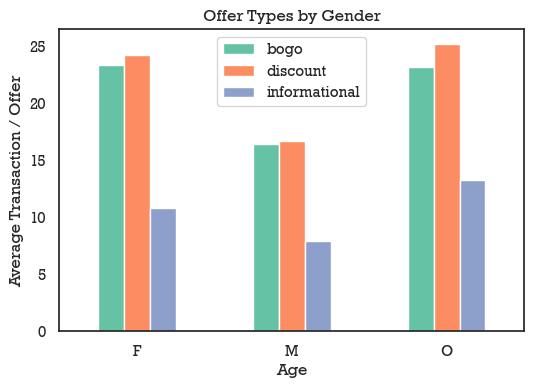

Females in general spend a lot more per transaction than males. While the number of samples are lower for people who identify as "Other", they seem to be spending about as much as females. 

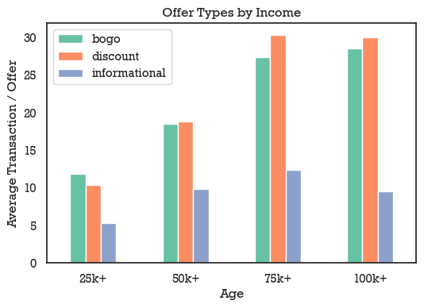

The more people make, the more they spend, as expected. the BOGO offer slightly outperforms discounts for the 25k-50k income bracket, but above 75k income the discount offers work better.

## Most Effective Channel Analysis

The portfolio data set contains information about what channels each offer was delivered to customers through (email, social, mobile, web).

We'll perform linear regression analysis on all offer records to find out which delivery channel results in offers being viewed.

Linear regression attempts to fit a line that best estimates observed data.


The output Y will be whether the offer was viewed. The X parameters represent the channels of delivery, and the linear regression model will try to find weights for each X parameter.

We'll use the [TheilSenRegressor](https://scikit-learn.org/stable/modules/generated/sklearn.linear_model.TheilSenRegressor.html) model from the [scikit-learn](https://scikit-learn.org/) package. We'll also test different parameters to find the most optimum settings.

The code for fitting the linear regression model while also finding the best parameters to achieve th best result:

```
# split into train and test
X_train, X_test, y_train, y_test = train_test_split(X, y, test_size=.25, random_state=42)

print('X shape:', X_train.shape)

# use the Theil-Sen estimator to fit a linear model
# https://en.wikipedia.org/wiki/Theil%E2%80%93Sen_estimator

best_model = None
best_score = 0

parameter_grid = {
    'n_subsamples': [10, 20, 100, 1000],
    'max_subpopulation': [500, 1000, 2000, 5000]
}

parameter_search_results = np.zeros((len(parameter_grid['n_subsamples']),len(parameter_grid['max_subpopulation'])), dtype=np.float64)

print('-----------')
for i in range(len(parameter_grid['n_subsamples'])):
    n_subsamples = parameter_grid['n_subsamples'][i]
    for o in range(len(parameter_grid['max_subpopulation'])):
        max_subpopulation = parameter_grid['max_subpopulation'][o]
        lm_model = TheilSenRegressor(random_state=42, n_subsamples=n_subsamples, fit_intercept=True, verbose=False, max_subpopulation=max_subpopulation)
        lm_model.fit(X_train, y_train)
        y_test_preds = lm_model.predict(X_test)
        test_score = r2_score(y_test, y_test_preds)
        if test_score > best_score:
            best_score = test_score
            best_model = lm_model
        print(f'max_iter: {n_subsamples}, max_subpopulation: {max_subpopulation}, test_score:{test_score}')
        np.put(parameter_search_results, (i + o*len(parameter_grid['n_subsamples'])), test_score)
print('-----------')

print(f'best model: {best_model}')
print(f'best score: {best_score}')

# predict
y_test_preds = best_model.predict(X_test)
y_train_preds = best_model.predict(X_train)

# score
test_score = r2_score(y_test, y_test_preds)
train_score = r2_score(y_train, y_train_preds)
```

A heat map of the model's performance based on the parameters tested:

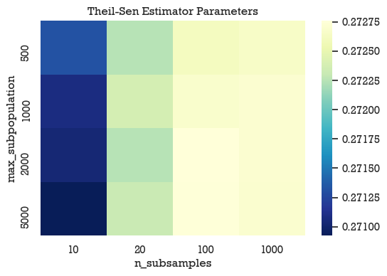

Based on this test, the best parameters for the model are **TheilSenRegressor(max_subpopulation=2000, n_subsamples=100)**.

Now that we have a fitted model, we can take a look at which parameter has the highest positive correlation.

The following code displays the model's fitted weights:

```
def get_model_coefficients(coefficients, variable_names, drop_variable_names=None):
    '''
    INPUT:
    coefficients - the coefficients of the linear model
    variable_names - names of variables corresponding to coefficients
    drop_variable_names - drop variables with these names (useful for removing poly offset)
    OUTPUT:
    df_c - a dataframe holding the coefficient and abs(estimate)
    
    Provides a dataframe that can be used to understand the most influential coefficients
    in a linear model by providing the coefficient estimates along with the name of the 
    variable attached to the coefficient.
    '''
    df_c = pd.DataFrame()
    df_c['column'] =  variable_names
    df_c['weight'] = lm_model.coef_
    df_c['abs(weight)'] = np.abs(lm_model.coef_)
    for i in drop_variable_names:
        df_c = df_c.drop(labels=list(df_c.index[df_c['column']==i]), axis=0)
    df_c = df_c.sort_values('abs(weight)', ascending=False)
    return df_c

#display coefficients of fitted model
df_c = get_model_coefficients(lm_model.coef_, list(X_train.columns), drop_variable_names=['poly_offset'])
pal = sns.color_palette("pastel").as_hex()
df_c.style.bar(subset=['weight'], color=[pal[3], pal[2]])
```

The output:


This indicates that promotions delivered through social media are most likely to be viewed by customers, while promotions advertised on the web are less likely viewed.

## Conclusion

This was a fun, but challenging project. The most challenging part was parsing and reorganizing the data to be offer centric.

While this was mock data, it was very successful at showing that data in real life is not always perfect. In this instance, the transaction records were not linked to specific promotional offers sent to customers, so had to use some creative problem solving to figure out which transaction is most likely the result of which promotion.

We set out to answer the following question: which promotional offer works best for which demographic group?

There is not a one size fits all answer, but we can use the following guidelines:

- Females in general spend a lot more per promotional transactions than males so targetting females will result in higher revenue.
- Probably not surprisingly, people in higher income brackets spend more money per promotional offer. Discount offers slightly outperform BOGO promotions for high earners, while buy-one-get-one-free offer work better for the lowest income brackets.
- Younger people spend less than people 50 and up, so it would be more efficient to target older customers.

We also looked at which delivery channel works best to have customers view offers. Social media had the highest positive correlation followed by mobile an email, while the web channel was least successful.

Future improvements:
- Try to improve the data collection process so transactions could be linked to promotions.
- Experiment with other machine learning solutions to find correlation between offer parameters and offer performance.
- Analyze whether promotions have effect on purchasing hapit past their duration.


